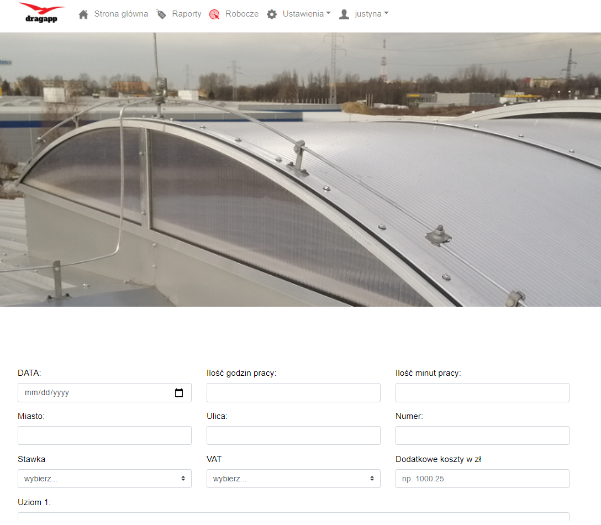
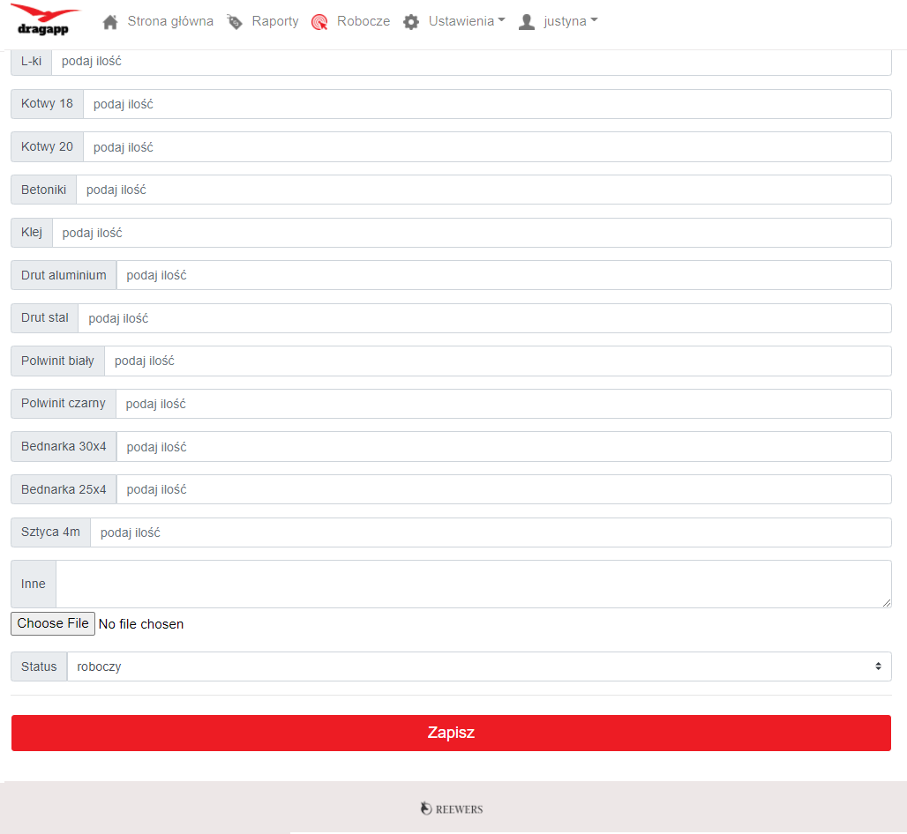
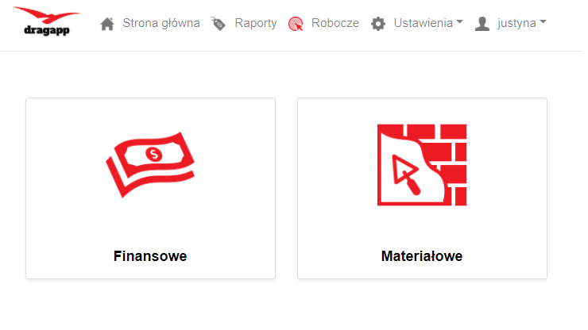
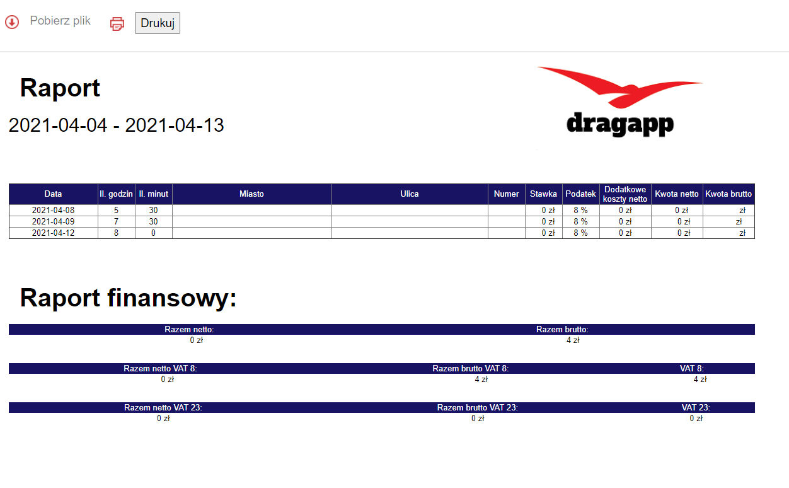
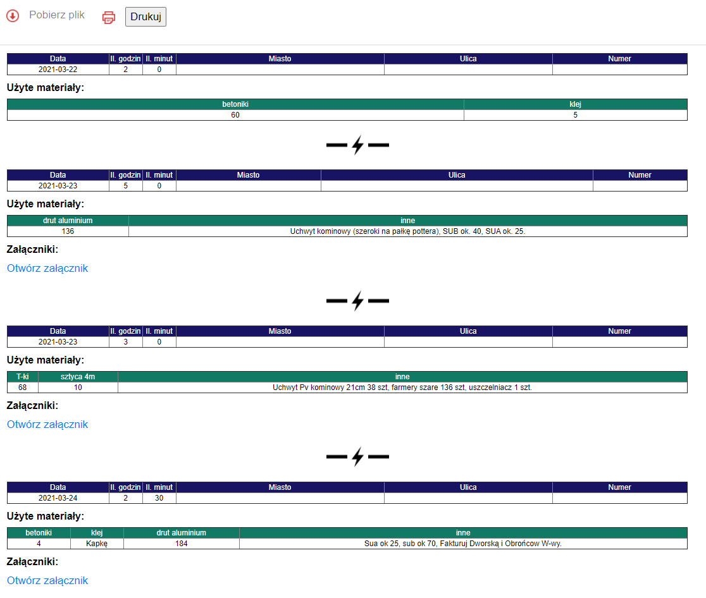

# DragApp
## Application to reporting thunder protective services
---

## Table of contents
* [General info](#General-info)
* [Technologies](#technologies)
* [Look of app](#look-of-app)
* [Features](#technologies)
* [To do](#technologies)
* [Project status](#technologies)

<a name="General-info">

### General info
The aim of the project was to create a web application that would  manage construction works. The application includes 2 types of access:
* for the construction team - entry and archiving of the thunder protection system construction works. Additionally, reporting the amount of used building materials;
* for the investor - downloading daily reports with the amount of used construction materials.
###### The application in this production version has been in use since November 2020. The earlier version was written in Python and it was a desktop application.

###### The motivation to write the application was the need to automate the work of a friendly company ordering the service. The application was created as a non-profit project.

### Technologies

* PHP
* Javascript
* Bootstrap v4.4.1
* HTML
* CSS
* jquery 3.4.1

### Look of app

#### Data entry panel

#### Adding buildings materials

### Reports panel

### Financial report

### Materials report

### Features
* adding data to base
* modifying data in database
* adding attachment to report
* adding measurements
* adding used materials
* generating financial reports
* generating materials reports
* downloading reports to csv
* delete position form database
* login/logout
* changing password

### To do
Converting an application using the Yii framework. Remodeling code to clear and object-oriented form. 

### Project status
In use. 

